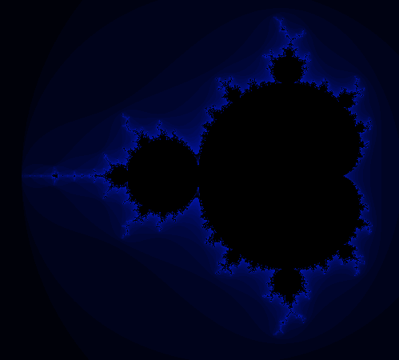
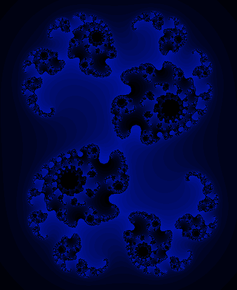

# Fractol

## Table of Contents

- [Fractol](#fractol)
  - [Table of Contents](#table-of-contents)
  - [About ](#about-)
    - [What is a Fractal?](#what-is-a-fractal)
    - [Example Fractals](#example-fractals)
  - [Getting Started ](#getting-started-)
    - [Prerequisites](#prerequisites)
    - [Installing](#installing)
  - [Usage ](#usage-)
  - [Acknowledgements ](#acknowledgements-)


## About <a name = "about"></a>

This project is one of the graphical project in 42. This let us learn how to draw fractals using the minilibx in C, learn about iteration and recursion and apply some maths concepts with the use of complex numbers.

### What is a Fractal?

A fractal is a complex geometric shape that can be split into parts, each of which is a reduced-scale copy of the whole. This property is known as self-similarity. Fractals are often found in nature, where objects like snowflakes, mountain ranges, lightning bolts, and coastlines exhibit fractal-like patterns.

### Example Fractals

  1. Mandelbrot Set: Defined by iterating the function $z_{n+1} = z_n^2 + c$, where $z$ and $c$ are complex numbers. The set consists of values of $c$ for which the sequence does not tend to infinity.
   <center>
    
  </center>

  2. Julia Set: Similar to the Mandelbrot set but focuses on the behavior of the sequence $z_{n+1}=z_n^2+k$, where $k$ is a constant complex number and $z$ varies.

   <center>
    
  </center>

## Getting Started <a name = "getting_started"></a>

### Prerequisites

- On some Linux the following libraries may not be present:
  - libc-dev for math.h
    ```
    sudo apt-get install libc6-dev
    ```
  - libx-dev to get X11 which is needed for the mlx_linux
    ```
    sudo apt-get install libx11-dev
    ```
    - X11 provides a standard toolkit for our GUI and device inputs on UNIX OS and has been ported to other OS.
  - libxext-dev to get XShm.h which is needed for the mlx_linux
    ```
    sudo apt-get install libxext-dev
    ```
    - The header XSHm.h provides functions for the X Shared Memory Extension. X11 likely uses it update the contents of its windows efficiently.
  - libbsd-dev to get libbsd library which is used by the Makefile in mlx_linux
    ```
    sudo apt-get install libbsd-dev
    ```
    - This library provides useful functions commonly found on BSD systems, and lacking on others like GNU systems, thus making it easier to port projects with strong BSD origins, without needing to embed the same code over and over again on each project.

    If none are present on your linux then you can execute the following code:
    ```
    sudo apt-get install libc6-dev libx11-dev libxext-dev libbsd-dev
    ```


- On Mac the libraries should already be present

### Installing

1. Clone the repo
  ```
    git clone https://github.com/phlearning/fract-ol.git
  ```
2. Compile the code with through the Makefile
  ```
    make
  ```
3. Run the app with the any of the following arg: mandelbrot, julia or burningship
  ```
    ./fractol mandelbrot
  ```

## Usage <a name = "usage"></a>

> Some of the following keys may not work as it was coded with a QWERTY keyboard on the mac, and an AZERTY keyboard on linux.

  Once the application has been launched you should be able to see a help menu:
  - On any set:
    - The arrows will move the camera
    - Left click will zoom towards the click
    - Right click will dezoom from the click
    - Shift to change fractals
    - 1, 2, 3 below the function keys should change the color
  - On julia set:
    - moving the mouse will change the drawing
    - P will stop the changes

## Acknowledgements <a name = "acknowledgements"></a>

- https://www.youtube.com/watch?v=ZQ8qtAizis4 (panning and zooming)
- https://realpython.com/mandelbrot-set-python/ (in python)
- https://en.wikipedia.org/wiki/Mandelbrot_set (pseudocode)
- https://courses.lumenlearning.com/wmopen-mathforliberalarts/chapter/introduction-fractals-generated-by-complex-numbers/ (complex numbers)